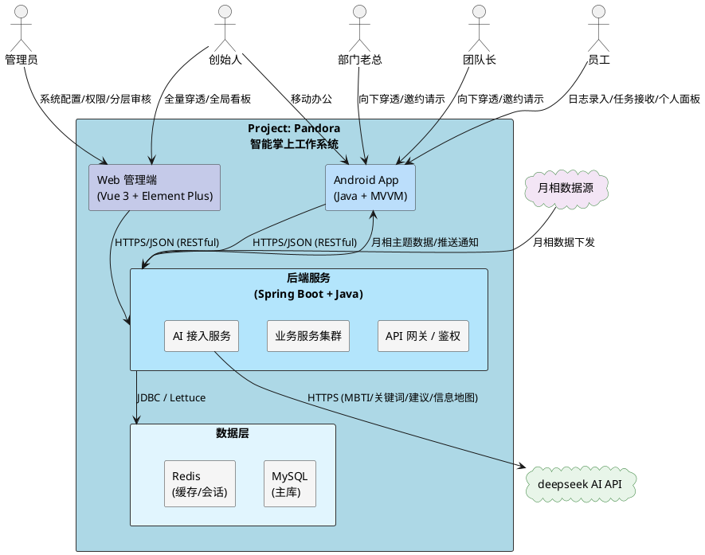
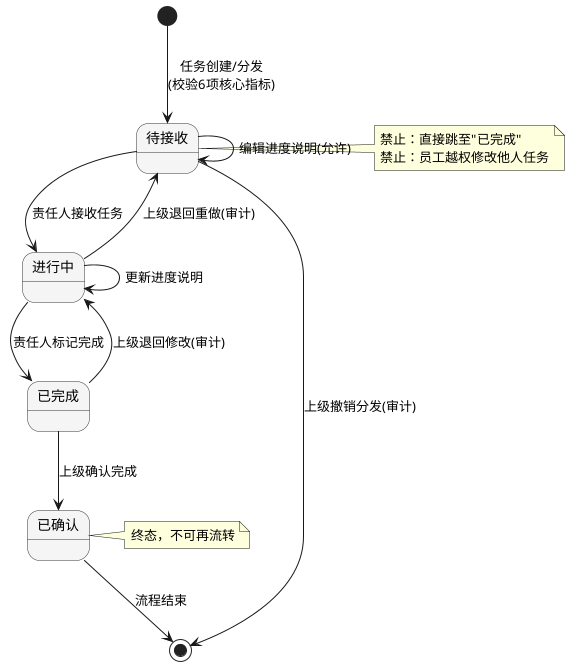
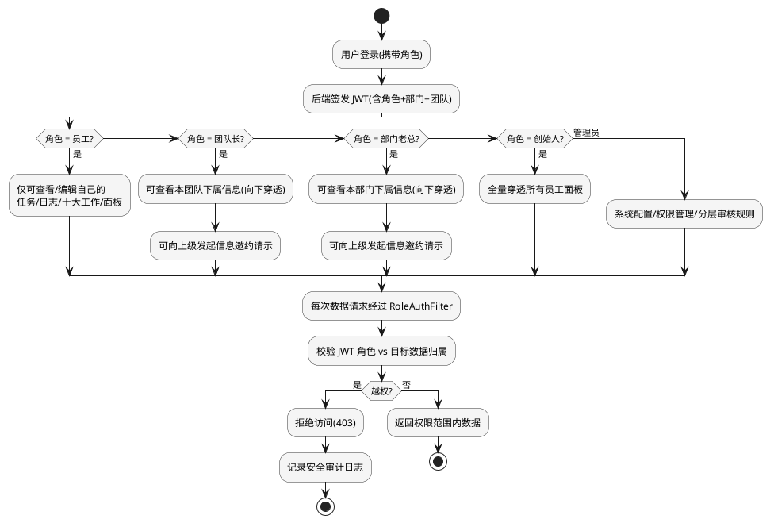
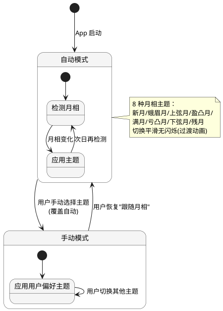
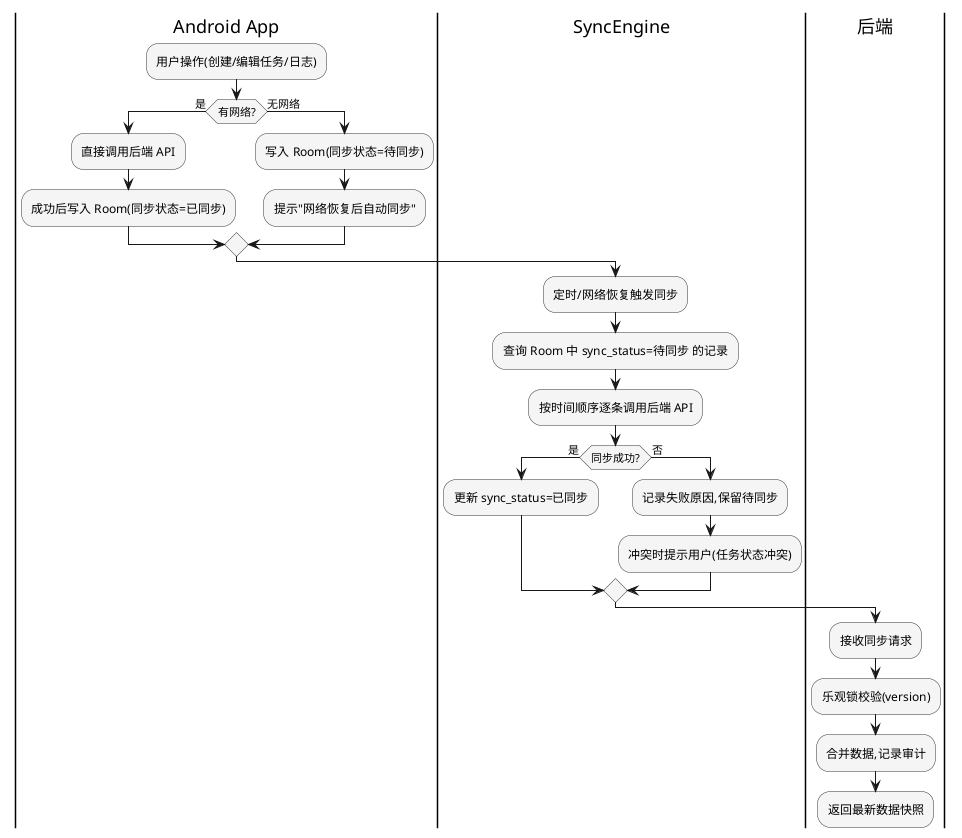
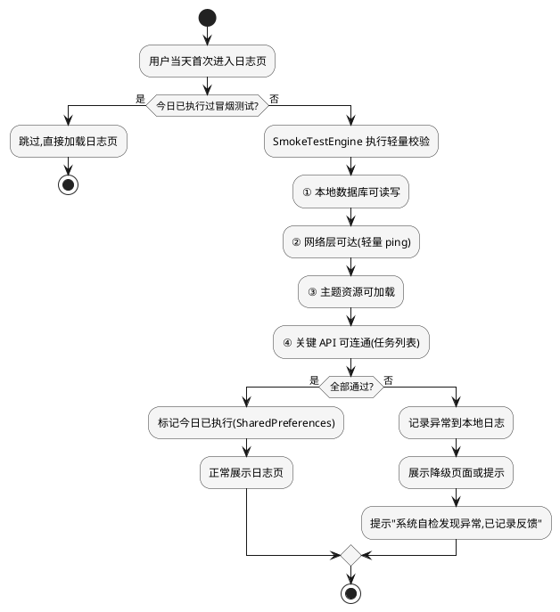
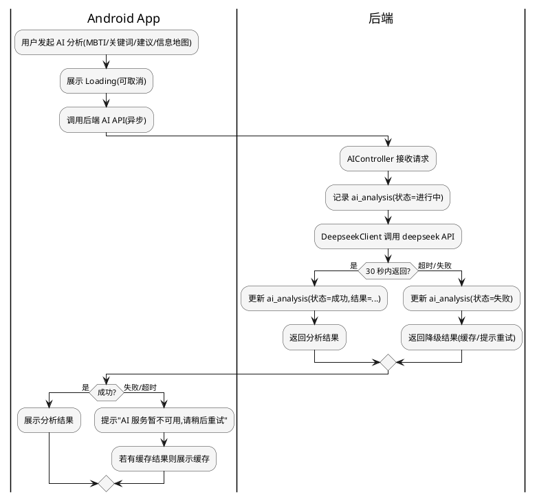
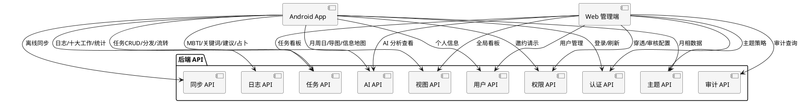
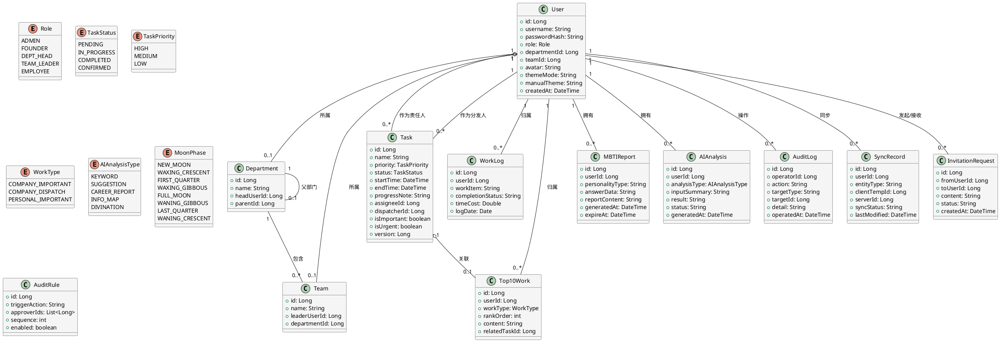

# Project: Pandora 智能掌上工作系统 - 技术设计文档

> **文档版本**: v1.0  
> **生成日期**: 2026-09-11  
> **项目代号**: Project: Pandora（潘多拉）  
> **当前阶段**: Sprint 0 - 实现方案创建（技术设计）  
> **配套需求文档**: `.codeartsdoer/specs/pandora_work_system/spec.md`  
> **GitHub仓库**: https://github.com/yangnayangnay/Project-Pandora

---

# 一、需求与存量功能关系分析

## 1.1 需求功能与存量功能对比

### 1.1.1 已实现功能

当前项目为 Android Studio 默认模板生成的全新工程，仅包含模板骨架代码，无任何业务功能实现。下表对需求功能与存量代码进行对比：

| 需求功能 | 存量功能 | 代码位置 | 匹配度 |
|---------|---------|---------|--------|
| 应用启动入口 | MainActivity 模板入口 | `app/src/main/java/com/example/project_pandora/MainActivity.java` | 25% |
| 页面导航框架 | Navigation Component 双 Fragment 切换 | `app/src/main/res/navigation/nav_graph.xml` + `FirstFragment.java` + `SecondFragment.java` | 25% |
| Material Design 基础主题 | 默认 Theme.Project_Pandora 主题 | `app/src/main/res/values/themes.xml` | 25% |
| ViewBinding 能力 | 已开启 viewBinding = true | `app/build.gradle.kts:35-36` | 100% |
| Android 基础依赖 | appcompat / material / constraintlayout / navigation 已引入 | `gradle/libs.versions.toml` | 100% |
| 任务管理（创建/分发/状态流转/四象限） | 无 | — | 0% |
| 日志管理（录入/统计/十大工作/晨星冒烟测试） | 无 | — | 0% |
| 视图展示（月/周/日视图、导图页、四象限视图、信息地图） | 无 | — | 0% |
| AI 智能分析（MBTI/关键词/个性化建议/AI信息地图/每日占卜） | 无 | — | 0% |
| 角色权限管理（5种角色/信息穿透/邀约请示/分层审核） | 无 | — | 0% |
| 主题与界面管理（8种月相主题/手动覆盖/底部导航/竖屏） | 无 | — | 0% |
| Web 管理端 | 无 | — | 0% |
| 后端服务（API/数据库/认证/AI接入） | 无 | — | 0% |

**结论**：项目处于"零业务代码"状态，所有业务功能均需从零构建。存量代码仅提供 Android 工程骨架（入口 Activity、Navigation 框架、Material 主题、ViewBinding），可作为工程脚手架复用，但需重构为符合业务架构的形态。

### 1.1.2 需要扩展的功能

| 需求功能 | 存量功能 | 差异说明 | 扩展方向 |
|---------|---------|---------|---------|
| 底部导航栏（导图/视图/日志/AI地图/我的 5 项） | 现有 Navigation 仅有 2 个 Fragment 且使用 ActionBar 导航 | ① 导航项数量不足（2→5）；② 缺少 BottomNavigationView；③ 缺少 5 个业务 Fragment；④ 主题需改为卡通快乐风格 | 重构 `activity_main.xml`：移除 ActionBar+Fab 模板，改为 BottomNavigationView + NavHost；扩展 `nav_graph.xml` 至 5 个目的地；新增 5 个业务 Fragment |
| 应用主入口与主题初始化 | MainActivity 仅做模板初始化（EdgeToEdge/Toolbar/Fab） | ① 缺少月相主题初始化逻辑；② 缺少登录态校验；③ 缺少竖屏锁定；④ 缺少本地日志模块初始化；⑤ 缺少全局异常捕获 | 改造 MainActivity：onCreate 中加入竖屏锁定、月相主题应用、登录态路由、日志模块初始化、CrashHandler 注册 |
| Material 主题 | 默认 Material3 主题，无卡通风格定制 | ① 缺少 8 套月相主题；② 缺少卡通配色/字体/圆角/插画资源；③ 缺少主题切换动画 | 新增 `values-theme-moon_new.xml` 等 8 套主题；扩展 `colors.xml`、`dimens.xml`、`strings.xml`；新增主题切换工具类 |

### 1.1.3 需要新增的功能或接口

按业务模块分组，列出完全新增的功能点：

#### A. 后端服务模块（全新构建）
- **用户认证服务**：登录、登出、Token 签发与校验、角色权限鉴权
- **用户管理服务**：用户 CRUD、角色分配、部门/团队层级维护
- **任务管理服务**：任务 CRUD、任务分发、状态流转、四象限分类、进度同步
- **日志管理服务**：日志 CRUD、十大工作编辑、日志统计聚合（完成率/重要占比/分析竖图）
- **视图数据服务**：月/周/日视图数据聚合、导图页四大板块数据聚合、信息数据地图数据
- **AI 接入服务**：deepseek API 代理、MBTI 报告生成、关键词分析、个性化建议、AI信息地图、每日占卜（梅花易数）
- **权限穿透服务**：信息穿透鉴权、信息邀约请示、分层审核规则配置与触发
- **主题数据服务**：月相数据计算与下发
- **审计日志服务**：关键操作审计记录
- **数据同步服务**：Android 端离线数据同步、Web/Android 数据一致性保障

#### B. Android App 模块（全新构建）
- **登录模块**：登录页、登录态持久化、角色路由
- **任务模块**：任务列表页、任务创建/编辑页、任务分发页、四象限视图页、任务详情页
- **日志模块**：日志列表页、日志录入页、日志统计页（完成率表格/饼图/竖图）、十大工作编辑页、晨星冒烟测试
- **视图模块**：月视图、周视图、日视图、导图页（四大板块）、信息数据地图页
- **AI 模块**：MBTI 测试页、MBTI 报告页、关键词分析页、个性化建议页、AI信息地图页、每日占卜页
- **我的模块**：个人面板（类人人网风格）、主题设置页、个人信息页
- **主题模块**：月相主题管理器、8 套主题资源、主题切换动画
- **基础架构**：MVVM 基类、网络层（Retrofit+OkHttp）、本地数据库（Room）、离线同步引擎、本地日志管理器、图表组件、日历组件、CrashHandler、全局异常处理

#### C. Web 管理端模块（全新构建）
- **登录与鉴权**：管理员/创始人/部门老总/团队长登录、Token 管理
- **全局看板**：公司全量任务/日志/人员概览、数据可视化大屏
- **任务管理**：任务分发、状态监控、四象限看板
- **人员与权限**：用户管理、角色配置、分层审核规则配置
- **AI 分析**：MBTI 报告查看、关键词分析、AI信息地图
- **系统配置**：月相主题策略、审计日志查询

#### D. 数据库模块（全新构建）
- 11 张核心表：user、role、department、team、task、work_log、top10_work、mbti_report、ai_analysis、audit_log、sync_record
- 表结构遵循 4NF，提供 `.sql` 建表脚本

#### E. 协作与工程模块
- **README.md**：项目说明与维护
- **需求分析.txt / 需求改动.txt / 代码改动.txt**：文档先行机制
- **特色小巧思.txt**：保留代码特色实现细节记录
- **run-server.bat**：Windows 批处理启动后端服务

## 1.2 存量功能详细分析

### 1.2.1 MainActivity（模板入口）

- **接口契约**：`onCreate(Bundle)` 完成视图绑定、Toolbar 设置、NavController 配置、Fab 点击（仅 Snackbar 占位）；`onCreateOptionsMenu`/`onOptionsItemSelected` 菜单占位；`onSupportNavigateUp` 导航回栈。
- **业务规则**：无业务规则，纯模板代码。Fab 点击仅展示 "Replace with your own action"。
- **扩展点**：Navigation 框架已就绪，可通过扩展 `nav_graph.xml` 增加目的地；ViewBinding 已开启，可直接使用。
- **约束**：使用 AppCompatActivity + EdgeToEdge + WindowInsets；Java 11；依赖 Navigation 2.6.0、Material 1.10.0。
- **重构必要性**：高。需移除模板 Fab/ActionBar，改为底部导航；需注入主题、登录态、日志、Crash 等初始化逻辑。

### 1.2.2 FirstFragment / SecondFragment（模板占位）

- **接口契约**：模板占位 Fragment，仅展示文本与按钮跳转。
- **业务规则**：无。
- **扩展点**：可作为 5 个业务 Fragment 的参考模板，但建议重写而非复用。
- **约束**：依赖 Navigation Component。
- **重构必要性**：高。将删除并替换为 5 个业务 Fragment（导图/视图/日志/AI地图/我的）。

### 1.2.3 Navigation 与主题资源

- **nav_graph.xml**：仅含 first→second 两个目的地，需扩展至 5 个主目的地 + 多个子目的地（详情页）。
- **themes.xml**：默认 Material3 主题，无卡通定制，需新增 8 套月相主题变体。
- **colors.xml / dimens.xml / strings.xml**：仅含模板资源，需大幅扩充业务配色、尺寸、文案。

### 1.2.4 Gradle 构建配置

- **接口契约**：`app/build.gradle.kts` 配置 namespace、applicationId、minSdk 24、targetSdk 36、Java 11、viewBinding。
- **约束**：使用 AGP 9.2.1、Version Catalog（libs.versions.toml）管理依赖。
- **扩展方向**：需新增 Retrofit、OkHttp、Room、RxJava/Coroutines、Hilt、MPAndroidChart、Glide、加密库等依赖；需配置网络权限、存储权限等。

---

# 二、增量设计方案

## 2.1 实现模型

### 2.1.1 上下文视图

下图展示 Project: Pandora 系统与外部角色、外部系统的交互关系：



**通信协议与调用频率说明**：
- Android App ↔ 后端：HTTPS + JSON，RESTful 风格；高频调用（任务/日志列表每分钟级），需配套 Token 鉴权与离线缓存。
- Web 管理端 ↔ 后端：HTTPS + JSON；中频调用（看板/配置）。
- 后端 ↔ deepseek：HTTPS，低频但耗时（MBTI ≤30s，关键词 ≤10s），需异步回调与超时熔断。
- 后端 ↔ MySQL：JDBC 连接池；高频读写，需事务保障。
- 后端 ↔ Redis：Lettuce 客户端；会话/缓存/限流。
- 月相数据源 → 后端：每日一次拉取或本地天文算法计算。

### 2.1.2 服务/组件总体架构

#### 2.1.2.1 系统总体分层架构

```plantuml
@startuml
skinparam component {
    BackgroundColor #F5F5F5
    BorderColor #333333
}

package "Android App (Java + MVVM)" as AndroidPackage #BBDEFB {
    package "UI 层 (View)" as UIView {
        component [Activity\n(MainActivity/LoginActivity)] as MainActivityC
        component [Fragment\n(导图/视图/日志/AI地图/我的)] as Fragments
        component [Adapter\n(任务/日志/图表适配器)] as Adapters
        component [自定义 View\n(四象限/日历/饼图/竖图)] as CustomViews
    }
    package "ViewModel 层" as VM {
        component [TaskViewModel] as TaskVM
        component [LogViewModel] as LogVM
        component [ViewViewModel] as ViewVM
        component [AIVM]
        component [UserViewModel] as UserVM
        component [ThemeViewModel] as ThemeVM
    }
    package "Repository 层" as Repo {
        component [TaskRepository] as TaskRepo
        component [LogRepository] as LogRepo
        component [UserRepository] as UserRepo
        component [AIRepository] as AIRepo
        component [ThemeRepository] as ThemeRepo
    }
    package "数据源层 (Data)" as Data {
        component [RemoteDataSource\n(Retrofit API)] as Remote
        component [LocalDataSource\n(Room DAO)] as Local
        component [PreferenceSource\n(SharedPreferences)] as Pref
        component [SyncEngine\n(离线同步)] as Sync
    }
    package "基础架构 (Core)" as Core {
        component [NetworkModule] as Net
        component [DatabaseModule] as DB
        component [Logger\n(本地日志管理器)] as Logger
        component [CrashHandler] as Crash
        component [ThemeManager\n(月相主题)] as ThemeMgr
        component [MoonPhaseCalculator] as MoonCalc
        component [DivinationEngine\n(梅花易数)] as Divination
        component [SmokeTestEngine\n(晨星冒烟测试)] as SmokeTest
    }
}

package "后端服务 (Spring Boot)" as BackendPackage #B3E5FC {
    component [AuthController\n(认证/鉴权)] as AuthCtrl
    component [UserController] as UserCtrl
    component [TaskController] as TaskCtrl
    component [LogController] as LogCtrl
    component [ViewController\n(视图数据聚合)] as ViewCtrl
    component [AIController] as AICtrl
    component [PermissionController\n(穿透/邀约/审核)] as PermCtrl
    component [ThemeController] as ThemeCtrl
    component [AuditService] as AuditSvc
    component [DeepseekClient\n(AI 代理)] as DeepseekC
    component [SyncController\n(数据同步)] as SyncCtrl
}

package "Web 管理端 (Vue 3)" as WebPackage #C5CAE9 {
    component [登录页] as WebLogin
    component [全局看板] as WebDashboard
    component [任务管理] as WebTask
    component [人员权限] as WebUser
    component [AI 分析] as WebAI
    component [系统配置] as WebConfig
}

package "数据层" as DBPackage #E1F5FE {
    component [MySQL\n(11 张业务表)] as MySQLC
    component [Redis\n(会话/缓存/限流)] as RedisC
}

' Android 内部依赖
UIView --> VM : LiveData/观察者
VM --> Repo
Repo --> Remote
Repo --> Local
Repo --> Pref
Repo --> Sync
VM --> Core

' 后端依赖
AuthCtrl --> AuditSvc
TaskCtrl --> AuditSvc
PermCtrl --> AuditSvc
AICtrl --> DeepseekC

' 跨端依赖
Remote --> AuthCtrl : HTTPS
Remote --> UserCtrl
Remote --> TaskCtrl
Remote --> LogCtrl
Remote --> ViewCtrl
Remote --> AICtrl
Remote --> PermCtrl
Remote --> ThemeCtrl
Remote --> SyncCtrl

WebLogin --> AuthCtrl
WebDashboard --> ViewCtrl
WebTask --> TaskCtrl
WebUser --> UserCtrl
WebAI --> AICtrl
WebConfig --> ThemeCtrl

BackendPackage --> DBPackage

@enduml
```



#### 2.1.2.2 Android 端模块划分与职责

| 模块 | 职责 | 核心类 |
|------|------|--------|
| `core/` | 基础架构：网络、数据库、日志、Crash、主题、月相、占卜、冒烟测试 | NetworkModule, DatabaseModule, PandoraLogger, CrashHandler, ThemeManager, MoonPhaseCalculator, DivinationEngine, SmokeTestEngine |
| `data/` | 数据源：远程 API、本地 Room、偏好、同步引擎 | RemoteDataSource, LocalDataSource, PreferenceSource, SyncEngine |
| `repository/` | Repository 层：统一数据来源调度 | TaskRepository, LogRepository, UserRepository, AIRepository, ThemeRepository |
| `viewmodel/` | ViewModel 层：UI 数据准备与状态管理 | TaskViewModel, LogViewModel, ViewViewModel, AIViewModel, UserViewModel, ThemeViewModel |
| `ui/` | UI 层：Activity/Fragment/Adapter/自定义 View | MainActivity, LoginActivity, MindMapFragment, ViewFragment, LogFragment, AIMapFragment, MineFragment, FourQuadrantView, CalendarView, PieChartView, BarChartView |
| `model/` | 领域模型与 DTO | User, Task, WorkLog, Top10Work, MBTIReport, AIAnalysis, MoonPhase, DivinationResult |

#### 2.1.2.3 后端模块划分与职责

| 模块 | 职责 | 核心组件 |
|------|------|----------|
| `auth/` | 认证鉴权：登录、JWT 签发/校验、角色鉴权过滤器 | AuthController, JwtUtil, RoleAuthFilter |
| `user/` | 用户与组织：用户 CRUD、部门/团队层级 | UserController, UserService, DepartmentService |
| `task/` | 任务管理：CRUD、分发、状态流转、四象限 | TaskController, TaskService, TaskStateMachine |
| `log/` | 日志管理：CRUD、十大工作、统计聚合 | LogController, LogService, LogStatService |
| `view/` | 视图数据：月/周/日聚合、导图页、信息地图 | ViewController, ViewAggregationService |
| `ai/` | AI 接入：deepseek 代理、MBTI、关键词、建议、信息地图、占卜 | AIController, DeepseekClient, MBTIService, KeywordService, DivinationService |
| `permission/` | 权限：信息穿透、邀约请示、分层审核 | PermissionController, PenetrationService, InvitationService, AuditRuleService |
| `theme/` | 主题：月相计算与下发 | ThemeController, MoonPhaseService |
| `audit/` | 审计：关键操作记录 | AuditService, AuditAspect |
| `sync/` | 同步：离线数据合并、一致性保障 | SyncController, SyncService |

#### 2.1.2.4 关键技术选型与理由

| 维度 | 选型 | 理由 |
|------|------|------|
| Android 语言 | Java | 用户偏好且当前工程已用 Java；与后端 Java 统一技术栈降低认知成本 |
| Android 架构 | MVVM + Repository | 官方推荐架构，ViewBinding 已就绪；LiveData 解耦 UI 与数据；Repository 统一线上线下数据源 |
| Android 异步 | RxJava 3 | 复用 spec 中"本地日志清理后台线程""AI 异步"等场景；线程调度能力强 |
| Android 网络 | Retrofit 2 + OkHttp 3 | RESTful 标配，与 Spring Boot 接口契合 |
| Android 本地数据库 | Room | Jetpack 官方 ORM，编译期 SQL 校验，配合离线同步 |
| Android 依赖注入 | Hilt | Jetpack 官方 DI，减少样板代码 |
| Android 图表 | MPAndroidChart | 完成率表格/饼图/竖图成熟方案 |
| Android 日历 | 自定义 CalendarView | 月/周/日视图需深度定制卡通风格，三方库难以满足 |
| 后端框架 | Spring Boot 3 + Java 17 | 用户熟悉 Java；生态成熟；RESTful/JWT/事务开箱即用 |
| 后端数据库 | MySQL 8.0 | 关系型契合组织层级与任务关联；4NF 规范可落地 |
| 后端缓存 | Redis 7 | 会话/限流/月相缓存/AI 结果缓存 |
| AI 服务 | deepseek API | spec 指定；后端代理隔离密钥 |
| Web 框架 | Vue 3 + Vite + Element Plus + Pinia + ECharts | 用户偏好 Vue；Element Plus 适配管理后台；ECharts 适配大屏可视化 |
| 启动方式 | run-server.bat | 用户偏好 Windows 批处理启动后端 |

### 2.1.3 实现设计文档

#### 2.1.3.1 任务状态机设计

任务状态按 spec 必须遵循 `待接收 → 进行中 → 已完成 → 已确认` 流转，不得跳过中间状态：



**触发条件与处理策略**：
- `待接收 → 进行中`：仅责任人本人可触发；触发后推送上级"已接收"通知。
- `进行中 → 已完成`：仅责任人本人可触发；触发后推送上级"待确认"通知。
- `已完成 → 已确认`：仅任务分发人（或更高上级）可触发；触发后流程结束。
- 任何非法跳转：后端 `TaskStateMachine` 拒绝并返回 `400 INVALID_TRANSITION`，记录审计日志。
- 并发冲突：后端使用乐观锁（version 字段），先提交者成功，后提交者返回 `409 CONFLICT`。

#### 2.1.3.2 角色权限与信息穿透流程



**信息穿透鉴权规则**：
- 创始人：可访问任意 user_id 的数据。
- 部门老总：仅可访问 `department_id = 自身部门` 的下属数据。
- 团队长：仅可访问 `team_id = 自身团队` 的下属数据。
- 员工：仅可访问 `user_id = 自身` 的数据。
- 管理员：可访问系统配置类数据，不直接穿透业务数据（除非授权）。

#### 2.1.3.3 月相主题切换状态机



**月相计算策略**：后端 `MoonPhaseService` 基于天文算法（基于日期与已知新月参考点计算月龄，映射到 8 相位区间），每日计算一次并 Redis 缓存；App 启动与每日首次进入时拉取。月相数据源不可用时降级为默认主题。

#### 2.1.3.4 离线同步与数据一致性设计



**一致性策略**：
- Android 端 Room 表均含 `sync_status`（已同步/待同步/冲突）与 `last_modified` 字段。
- 网络恢复后 `SyncEngine` 后台逐条同步，冲突时以服务端为准并提示用户。
- Android 与 Web 端最终一致性延迟 ≤ 5 分钟（spec 4.2 要求）。

#### 2.1.3.5 晨星冒烟测试流程



#### 2.1.3.6 每日占卜（梅花易数）设计

- **触发**：用户在 AI 模块点击"每日占卜"。
- **输入**：当前日期（年月日时分）+ 用户 ID（作为起卦扰动因子）。
- **核心逻辑**：`DivinationEngine` 基于梅花易数规则——以时间起卦（年支数+月数+日数取上卦，加时支数取下卦，动爻由总和取余），得到本卦、互卦、变卦；映射为工作宜忌语义（如"宜：规划/沟通；忌：冲动决策"）。
- **输出**：`DivinationResult`（本卦名/变卦名/宜/忌/运势等级/趣味文案）。
- **定位**：扩展功能，纯本地计算无需调用 AI，增加趣味性与用户粘性。

#### 2.1.3.7 AI 分析异步与降级策略



**降级策略**：AI 服务不可用时优先展示 Redis 中该用户最近一次成功分析结果，并提示"展示的是历史分析结果"；无缓存时提示功能暂不可用。
## 2.2 接口设计

### 2.2.1 总体设计

#### 2.2.1.1 接口分类

| 分类 | 前缀 | 说明 | 稳定性 |
|------|------|------|--------|
| 认证接口 | `/api/auth/**` | 登录、登出、Token 刷新 | 稳定 |
| 用户与组织接口 | `/api/user/**`、`/api/dept/**`、`/api/team/**` | 用户/部门/团队 CRUD | 稳定 |
| 任务接口 | `/api/task/**` | 任务 CRUD、分发、状态流转、四象限 | 稳定 |
| 日志接口 | `/api/log/**` | 日志 CRUD、十大工作、统计 | 稳定 |
| 视图接口 | `/api/view/**` | 月/周/日聚合、导图页、信息地图 | 稳定 |
| AI 接口 | `/api/ai/**` | MBTI、关键词、建议、信息地图、占卜 | 实验（依赖外部 AI） |
| 权限接口 | `/api/perm/**` | 穿透、邀约请示、分层审核 | 稳定 |
| 主题接口 | `/api/theme/**` | 月相数据下发 | 稳定 |
| 同步接口 | `/api/sync/**` | 离线数据同步 | 稳定 |
| 审计接口 | `/api/audit/**` | 审计日志查询（仅管理员） | 稳定 |

#### 2.2.1.2 接口通用约定

- **协议**：HTTPS + JSON（UTF-8）。
- **认证**：除 `/api/auth/login` 外，所有接口需 Header `Authorization: Bearer <JWT>`。
- **统一响应体**：
  ```
  {
    "code": 200,           // 业务码：200成功，400参数错，401未认证，403越权，409冲突，500服务错，503AI不可用
    "message": "success",  // 提示文案
    "data": { ... },       // 业务数据
    "traceId": "xxx"       // 链路追踪ID
  }
  ```
- **分页**：列表接口统一 `page`（从1开始）、`size`（默认20，最大100）；响应含 `total`、`pages`。
- **时间格式**：ISO-8601（`yyyy-MM-dd'T'HH:mm:ssXXX`）。
- **ID 类型**：所有主键使用 `Long`（雪花 ID 或自增）。
- **版本管理**：URL 暂不显式版本号，通过 Header `X-Api-Version: 1` 控制；破坏性变更启用 `/api/v2/**`。
- **审计**：所有写操作经 `AuditAspect` 切面记录审计日志。
- **限流**：AI 接口经 Redis 令牌桶限流（单用户 10次/分钟）。

#### 2.2.1.3 接口调用关系图



### 2.2.2 接口清单

以下按业务分组列出核心接口签名。所有接口均为 RESTful 风格。

#### 2.2.2.1 认证接口（AuthController）

**1. 登录**
- 签名：`POST /api/auth/login`
- 入参：`{ "username": String, "password": String }`
- 出参：`{ "token": String, "refreshToken": String, "user": UserVO, "expiresIn": Long }`
- 业务说明：校验用户名密码，签发 JWT（含角色/部门/团队），返回用户基本信息用于前端路由。
- 前置条件：用户存在且未禁用。
- 后置条件：Redis 记录会话，审计日志记录登录。
- 异常映射：用户不存在/密码错 → `401 INVALID_CREDENTIALS`；账号禁用 → `403 ACCOUNT_DISABLED`。

**2. 登出**
- 签名：`POST /api/auth/logout`
- 入参：无（依据 Token）
- 出参：`{ "success": boolean }`
- 后置条件：Redis 清除会话。

**3. 刷新 Token**
- 签名：`POST /api/auth/refresh`
- 入参：`{ "refreshToken": String }`
- 出参：`{ "token": String, "expiresIn": Long }`

#### 2.2.2.2 用户与组织接口（UserController / DepartmentController / TeamController）

**4. 获取当前用户信息**
- 签名：`GET /api/user/me`
- 出参：`UserVO`（含角色、部门、团队、头像、个人面板聚合信息）

**5. 查询用户列表（穿透）**
- 签名：`GET /api/user/list?deptId=&teamId=&role=&page=&size=`
- 出参：`Page<UserVO>`
- 前置条件：调用者具备穿透权限（创始人/部门老总/团队长/管理员）。
- 异常映射：越权 → `403 FORBIDDEN`。

**6. 查看指定用户面板（穿透）**
- 签名：`GET /api/user/{userId}/panel`
- 出参：`{ "user": UserVO, "tasks": List<TaskVO>, "logs": List<WorkLogVO>, "top10": List<Top10WorkVO> }`
- 前置条件：调用者对该 userId 具备穿透权限。
- 异常映射：越权 → `403 FORBIDDEN`；用户不存在 → `404 USER_NOT_FOUND`。

**7. 用户 CRUD**
- 签名：`POST/PUT/DELETE /api/user/{userId}`
- 前置条件：仅管理员/创始人可操作。
- 后置条件：审计日志记录。

**8. 部门/团队 CRUD**
- 签名：`POST/PUT/DELETE /api/dept/{deptId}`、`/api/team/{teamId}`
- 前置条件：仅管理员可操作。

#### 2.2.2.3 任务接口（TaskController）

**9. 创建任务**
- 签名：`POST /api/task`
- 入参：`TaskCreateDTO { name, priority, startTime, endTime, progressNote, assigneeId, isImportant, isUrgent }`
- 出参：`TaskVO`
- 业务说明：个人任务任何用户可创建；分发任务（assigneeId ≠ 自己）需上级角色。校验 6 项核心指标完整性、时间节点合理性。
- 后置条件：任务状态置"待接收"，推送责任人通知，审计记录。
- 异常映射：缺必填项 → `400 MISSING_REQUIRED_FIELD`；时间不合理 → `400 INVALID_TIME_RANGE`；目标用户不存在 → `404 USER_NOT_FOUND`；越权分发 → `403 FORBIDDEN`。

**10. 查询任务列表**
- 签名：`GET /api/task/list?status=&quadrant=&assigneeId=&from=&to=&page=&size=`
- 出参：`Page<TaskVO>`
- 业务说明：按权限范围返回任务；支持按状态/象限/责任人/时间过滤。

**11. 任务详情**
- 签名：`GET /api/task/{taskId}`
- 出参：`TaskVO`

**12. 更新任务进度说明**
- 签名：`PATCH /api/task/{taskId}/progress`
- 入参：`{ "progressNote": String }`
- 前置条件：操作者为责任人本人或上级。

**13. 任务状态流转**
- 签名：`POST /api/task/{taskId}/transition`
- 入参：`{ "action": "receive" | "complete" | "confirm" | "reject", "reason": String }`
- 出参：`TaskVO`
- 业务说明：`receive`→进行中（仅责任人）；`complete`→已完成（仅责任人）；`confirm`→已确认（仅上级）；`reject`→退回（仅上级）。
- 异常映射：非法流转 → `400 INVALID_TRANSITION`；并发冲突 → `409 CONFLICT`。

**14. 四象限分类查询**
- 签名：`GET /api/task/quadrant`
- 出参：`{ "importantUrgent": List<TaskVO>, "importantNotUrgent": List<TaskVO>, "urgentNotImportant": List<TaskVO>, "notImportantNotUrgent": List<TaskVO> }`

#### 2.2.2.4 日志接口（LogController）

**15. 录入工作日志**
- 签名：`POST /api/log`
- 入参：`WorkLogCreateDTO { workItem, completionStatus, timeCost, logDate }`
- 出参：`WorkLogVO`
- 异常映射：内容为空 → `400 EMPTY_CONTENT`；timeCost 越界 → `400 INVALID_TIME_COST`。

**16. 查询日志列表**
- 签名：`GET /api/log/list?userId=&from=&to=&page=&size=`
- 出参：`Page<WorkLogVO>`
- 前置条件：查询他人日志需穿透权限。

**17. 编辑/删除日志**
- 签名：`PUT /api/log/{logId}`、`DELETE /api/log/{logId}`
- 前置条件：仅日志归属人本人可操作。

**18. 日志统计**
- 签名：`GET /api/log/stat?userId=&from=&to=`
- 出参：`{ "completionRateTable": [[...]], "importantRatioPie": {...}, "analysisBar": {...} }`
- 业务说明：返回完成率表格、重要占比饼图、数据分析竖图三类统计数据。

**19. 十大工作编辑**
- 签名：`PUT /api/log/top10`
- 入参：`List<Top10WorkDTO>`（工作类型：公司重要/公司派发/个人重要，排序序号 1-10）
- 出参：`List<Top10WorkVO>`

**20. 查询十大工作（穿透）**
- 签名：`GET /api/log/top10?userId=&type=`
- 出参：`List<Top10WorkVO>`

#### 2.2.2.5 视图接口（ViewController）

**21. 月视图数据**
- 签名：`GET /api/view/month?year=&month=`
- 出参：`{ "days": [{ "date": Date, "tasks": List<TaskVO>, "logs": List<WorkLogVO> }] }`

**22. 周视图数据**
- 签名：`GET /api/view/week?date=`
- 出参：`{ "days": [{ "date": Date, "tasks": List<TaskVO> }] }`

**23. 日视图数据**
- 签名：`GET /api/view/day?date=`
- 出参：`{ "tasks": List<TaskVO>, "logs": List<WorkLogVO> }`

**24. 导图页四大板块**
- 签名：`GET /api/view/mindmap`
- 出参：`{ "companyTop10": List<Top10WorkVO>, "companyDispatchTop10": List<Top10WorkVO>, "personalTop10": List<Top10WorkVO>, "personalLogs": List<WorkLogVO> }`

**25. 信息数据地图**
- 签名：`GET /api/view/info-map`
- 出参：`{ "nodes": [...], "edges": [...] }`（可视化地图节点与边）

#### 2.2.2.6 AI 接口（AIController）

**26. 发起 MBTI 测试**
- 签名：`POST /api/ai/mbti/submit`
- 入参：`{ "answers": List<AnswerDTO> }`
- 出参：`MBTIReportVO { reportId, personalityType, reportContent, generatedAt }`
- 业务说明：异步调用 deepseek 生成报告，超时 30s。
- 异常映射：AI 超时 → `503 AI_TIMEOUT`；AI 不可用 → `503 AI_UNAVAILABLE`。

**27. 查询 MBTI 报告**
- 签名：`GET /api/ai/mbti/report?userId=`
- 出参：`MBTIReportVO`

**28. 关键词分析**
- 签名：`POST /api/ai/keyword`
- 入参：`{ "sourceType": "log" | "task", "sourceIds": List<Long> }`
- 出参：`{ "keywords": [{ "word": String, "weight": Double, "rank": Int }] }`
- 业务说明：超时 10s。

**29. 个性化建议**
- 签名：`GET /api/ai/suggestion?userId=`
- 出参：`{ "workSuggestions": [...], "careerReport": String }`

**30. AI 信息地图**
- 签名：`GET /api/ai/info-map?scope=company|personal`
- 出参：`{ "futureTrend": [...], "direction": [...], "visualization": {...} }`

**31. 每日占卜**
- 签名：`GET /api/ai/divination`
- 出参：`DivinationResultVO { originalHexagram, changedHexagram, advisable, avoidable, luckLevel, funCopy }`
- 业务说明：基于梅花易数本地计算，无需调用 deepseek。

#### 2.2.2.7 权限接口（PermissionController）

**32. 发起信息邀约请示**
- 签名：`POST /api/perm/invitation`
- 入参：`{ "targetUserId": Long, "content": String, "attachments": List<String> }`
- 后置条件：上级收到请示通知，审计记录。

**33. 查询邀约请示列表**
- 签名：`GET /api/perm/invitation/list?status=&page=&size=`

**34. 分层审核规则配置**
- 签名：`POST/PUT /api/perm/audit-rule`
- 入参：`AuditRuleDTO { triggerAction, approverIds, sequence }`
- 前置条件：仅管理员可配置。
- 异常映射：规则冲突 → `400 RULE_CONFLICT`。

**35. 触发审核（任务分发时自动）**
- 签名：`POST /api/perm/audit-trigger`
- 业务说明：任务分发时按规则触发审核流，审核通过后任务才正式下发。

#### 2.2.2.8 主题接口（ThemeController）

**36. 获取当日月相**
- 签名：`GET /api/theme/moon-phase`
- 出参：`{ "phase": "NEW_MOON" | "WAXING_CRESCENT" | "FIRST_QUARTER" | "WAXING_GIBBOUS" | "FULL_MOON" | "WANING_GIBBOUS" | "LAST_QUARTER" | "WANING_CRESCENT", "themeName": String, "date": Date }`

**37. 设置用户主题偏好**
- 签名：`PUT /api/theme/preference`
- 入参：`{ "mode": "AUTO" | "MANUAL", "manualTheme": String }`
- 业务说明：MANUAL 模式覆盖自动月相主题。

#### 2.2.2.9 同步接口（SyncController）

**38. 离线数据批量同步**
- 签名：`POST /api/sync/batch`
- 入参：`{ "tasks": List<TaskSyncDTO>, "logs": List<WorkLogSyncDTO> }`（每条含 `clientVersion`、`lastModified`）
- 出参：`{ "results": [{ "clientTempId": Long, "serverId": Long, "status": "SUCCESS" | "CONFLICT", "serverData": Object }] }`
- 业务说明：乐观锁校验，冲突返回服务端最新数据由客户端决策。

#### 2.2.2.10 审计接口（AuditController）

**39. 查询审计日志**
- 签名：`GET /api/audit/list?userId=&action=&from=&to=&page=&size=`
- 出参：`Page<AuditLogVO>`
- 前置条件：仅管理员可查询。

#### 2.2.2.11 接口调用示例

**Android 端登录调用示例（Java + Retrofit）**：

```java
// API 接口定义
public interface AuthApi {
    @POST("api/auth/login")
    Call<ApiResponse<LoginVO>> login(@Body LoginDTO dto);
}

// 调用
LoginDTO dto = new LoginDTO("alice", "P@ssw0rd");
authApi.login(dto).enqueue(new Callback<ApiResponse<LoginVO>>() {
    @Override
    public void onResponse(Call<ApiResponse<LoginVO>> call, Response<ApiResponse<LoginVO>> resp) {
        if (resp.body().getCode() == 200) {
            tokenManager.save(resp.body().getData().getToken());
            navigationRouter.routeByRole(resp.body().getData().getUser().getRole());
        }
    }
    @Override
    public void onFailure(Call<ApiResponse<LoginVO>> call, Throwable t) {
        view.showError("网络异常，请稍后重试");
    }
});
```

**Web 端任务看板调用示例（Vue 3 + Axios）**：

```javascript
// api/task.js
import request from '@/utils/request'
export const fetchTasks = (params) => request.get('/api/task/list', { params })

// 视图调用
const { data } = await fetchTasks({ quadrant: 'IMPORTANT_URGENT', page: 1, size: 20 })
taskList.value = data.data.records
```

## 2.3 数据模型

### 2.3.1 设计目标

1. **支持的业务场景**：
   - 5 种角色的权限隔离与信息穿透（创始人全量、部门老总/团队长向下、员工自身）。
   - 任务全生命周期（创建→分发→接收→完成→确认）与四象限分类。
   - 日志录入、归属隔离、统计聚合（完成率/重要占比/分析竖图）。
   - 十大重要工作三维度（公司重要/公司派发/个人重要）。
   - MBTI 报告与 AI 分析记录的持久化与历史查询。
   - 离线同步（客户端临时 ID ↔ 服务端 ID 映射、乐观锁版本号）。
   - 审计日志的长期留存与查询。
   - 月相主题偏好按用户持久化。

2. **性能与容量目标**：
   - 单表数据量预期：task、work_log 百万级；audit_log 千万级；其余万级。
   - 索引策略：所有外键、高频过滤字段（status、assignee_id、log_date、created_at）建立索引。
   - 软删除：业务表使用 `deleted` 标记软删除，避免物理删除导致穿透数据断裂。

3. **与存量数据兼容策略**：
   - 当前为全新项目，无存量数据迁移问题。
   - 预留 `schema_version` 字段（或独立迁移版本表）支持后续版本平滑升级。

4. **规范约束**：
   - 表结构尽可能符合 4NF：消除多值依赖，将可独立维护的多值属性拆分为独立表（如用户角色虽为单角色，但部门/团队独立建表）。
   - 所有表含 `id`（BIGINT 主键）、`created_at`、`updated_at`、`deleted`（软删除标记）四个基础字段。
   - 命名：表名蛇形小写复数（如 `tasks`），字段蛇形小写（如 `assignee_id`）。
   - 字符集：utf8mb4，支持 emoji 与中文。
   - 提供 `pandora_schema.sql` 建表脚本。

### 2.3.2 模型实现

#### 2.3.2.1 核心领域对象类图



#### 2.3.2.2 对象关系说明

- **User ↔ Department/Team**：多对一聚合。部门老总关联部门，团队长关联团队，员工关联两者；管理员/创始人可空。
- **Department ↔ Team**：一对多组合。团队必须隶属某部门。
- **Department 自关联**：支持部门父子层级（用于多级穿透）。
- **User ↔ Task**：一个 User 可作为多个 Task 的责任人（`assigneeId`）或分发人（`dispatcherId`）。
- **Task ↔ Top10Work**：可选关联，Top10Work 可关联一个 Task（`relatedTaskId`）。
- **User ↔ WorkLog/Top10Work/MBTIReport/AIAnalysis**：一对多聚合，均按 userId 归属隔离。
- **User ↔ AuditLog**：操作者关联。
- **User ↔ InvitationRequest**：发起人（fromUserId）与接收人（toUserId）双关联。
- **User ↔ SyncRecord**：离线同步记录按用户隔离。

#### 2.3.2.3 对象创建与销毁策略

- **创建**：
  - `User`：仅管理员/创始人可创建，密码经 BCrypt 加密后存储。
  - `Task`：根据角色权限创建；个人任务任何用户可创建，分发任务需上级角色。
  - `WorkLog/Top10Work`：归属用户本人创建。
  - `MBTIReport/AIAnalysis`：由 AI 服务回调创建。
  - `AuditLog`：由 `AuditAspect` 切面自动创建，不可手动删除。
- **销毁**：
  - 业务数据采用软删除（`deleted=1`），保留穿透与审计可追溯性。
  - `AuditLog` 永不删除（合规要求）。
  - `SyncRecord` 同步成功后可定期清理（保留 30 天）。
  - 本地日志（Android `PandoraLogger`）按 spec NFR-2：每 7 天或超 50MB 清理，清理在后台线程执行。

#### 2.3.2.4 持久化策略

- **服务端持久化**：MySQL 8.0，所有业务表 InnoDB 引擎，utf8mb4 字符集。
  - 事务边界：任务状态流转、任务分发（含通知）、分层审核触发均需事务保障。
  - 乐观锁：`Task` 表含 `version` 字段，更新时 `WHERE id=? AND version=?`，影响行数 0 则返回 `409 CONFLICT`。
  - 索引：主键聚簇索引；`assignee_id+status`、`user_id+log_date`、`operator_id+operated_at` 等组合索引。
- **Android 端本地持久化**：Room 数据库，表结构与服务端核心表镜像（额外含 `sync_status`、`last_modified` 字段）。
  - 离线写入：先写 Room（`sync_status=PENDING`），网络恢复后 `SyncEngine` 同步。
  - 缓存策略：任务/日志列表 LRU 缓存，MBTI 报告长期缓存。
- **Redis 持久化**：
  - 会话：`session:{userId}` → JWT 信息，TTL 7 天。
  - 月相缓存：`moon_phase:{date}` → 月相枚举，TTL 25 小时。
  - AI 结果缓存：`ai_result:{userId}:{type}` → 分析结果，TTL 1 小时（降级备用）。
  - 限流：`rate_limit:{userId}:ai` → 令牌桶。

#### 2.3.2.5 数据库表清单（11 张核心表）

| 序号 | 表名 | 说明 | 4NF 拆分要点 |
|------|------|------|--------------|
| 1 | `users` | 用户主表 | 角色/部门/团队以枚举或外键解耦，不内嵌多值 |
| 2 | `departments` | 部门表 | 独立建表支持层级与多级穿透 |
| 3 | `teams` | 团队表 | 独立建表，隶属部门外键 |
| 4 | `tasks` | 任务表 | 责任人/分发人外键；重要性/紧急性独立布尔列支撑四象限 |
| 5 | `work_logs` | 工作日志表 | 归属用户外键；日志日期独立列支持按日聚合 |
| 6 | `top10_works` | 十大重要工作表 | 工作类型枚举 + 排序序号；关联任务可选外键 |
| 7 | `mbti_reports` | MBTI 报告表 | 答题数据以 JSON 字符串存储（非结构化）；报告内容独立列 |
| 8 | `ai_analyses` | AI 分析记录表 | 分析类型枚举；输入摘要与结果分离 |
| 9 | `audit_logs` | 审计日志表 | 操作人/目标外键；操作类型枚举；永不删除 |
| 10 | `invitation_requests` | 信息邀约请示表 | 发起人/接收人双外键；状态枚举 |
| 11 | `audit_rules` | 分层审核规则表 | 触发动作枚举；审批人列表以子表 `audit_rule_approvers` 拆分（避免多值依赖，符合 4NF） |

> **4NF 说明**：`audit_rules` 的审批人列表若内嵌为逗号分隔字符串将产生多值依赖，违反 4NF。故拆出子表 `audit_rule_approvers(rule_id, approver_id, sequence)`，消除多值依赖。

#### 2.3.2.6 Android 端 Room 本地表（镜像 + 同步字段）

Android 端 Room 数据库包含与服务端镜像的本地表，每张表额外增加：
- `sync_status`：`SYNCED`（已同步）/ `PENDING`（待同步）/ `CONFLICT`（冲突）
- `last_modified`：本地最后修改时间戳
- `client_temp_id`：离线创建时的客户端临时 ID（同步成功后映射为服务端 ID）

---

# 三、技术架构补充说明

## 3.1 Android 工程目录结构（符合 Android 规范）

```
app/src/main/java/com/example/project_pandora/
├── core/                          # 基础架构
│   ├── network/                   # Retrofit/OkHttp/拦截器
│   ├── database/                  # Room 数据库与 DAO
│   ├── logger/                    # PandoraLogger 本地日志管理器
│   ├── crash/                     # CrashHandler 全局异常
│   ├── theme/                     # ThemeManager 月相主题管理
│   ├── moon/                      # MoonPhaseCalculator 月相计算
│   ├── divination/                # DivinationEngine 梅花易数占卜
│   ├── smoketest/                 # SmokeTestEngine 晨星冒烟测试
│   └── di/                        # Hilt 依赖注入模块
├── data/
│   ├── remote/                    # RemoteDataSource + API 接口定义
│   ├── local/                     # LocalDataSource + Room DAO
│   ├── preference/                # PreferenceSource
│   └── sync/                      # SyncEngine 离线同步
├── repository/                    # Repository 层
├── viewmodel/                     # ViewModel 层
├── ui/
│   ├── login/                     # 登录页
│   ├── main/                      # MainActivity + 底部导航
│   ├── mindmap/                   # 导图页（四大板块）
│   ├── view/                      # 视图页（月/周/日 + 四象限）
│   ├── log/                       # 日志页（列表/录入/统计/十大工作）
│   ├── aimap/                     # AI 地图页
│   ├── mine/                      # 我的页（个人面板/主题设置）
│   ├── task/                      # 任务详情/创建/编辑/分发
│   ├── ai/                        # MBTI/关键词/建议/占卜
│   └── widget/                    # 自定义 View（四象限/日历/饼图/竖图）
└── model/                         # 领域模型与 DTO
```

**资源目录扩充**：
```
app/src/main/res/
├── values/                        # 基础 colors/dimens/strings/themes
├── values-theme-moon_new/         # 新月主题
├── values-theme-waxing_crescent/  # 蛾眉月主题
├── values-theme-first_quarter/    # 上弦月主题
├── values-theme-waxing_gibbous/   # 盈凸月主题
├── values-theme-full_moon/        # 满月主题
├── values-theme-waning_gibbous/   # 亏凸月主题
├── values-theme-last_quarter/     # 下弦月主题
├── values-theme-waning_crescent/  # 残月主题
├── drawable/                      # 卡通插画/图标
├── layout/                        # 布局
└── navigation/nav_graph.xml       # 扩展至 5 主目的地 + 子目的地
```

## 3.2 后端工程目录结构

```
pandora-backend/
├── src/main/java/com/pandora/backend/
│   ├── auth/                      # 认证鉴权
│   ├── user/                      # 用户与组织
│   ├── task/                      # 任务管理
│   ├── log/                       # 日志管理
│   ├── view/                      # 视图数据聚合
│   ├── ai/                        # AI 接入（deepseek 代理）
│   ├── permission/                # 权限穿透/邀约/审核
│   ├── theme/                     # 主题与月相
│   ├── audit/                     # 审计
│   ├── sync/                      # 数据同步
│   └── common/                    # 通用（统一响应/异常/工具）
├── src/main/resources/
│   ├── application.yml
│   └── db/pandora_schema.sql      # 建表脚本（4NF）
└── run-server.bat                 # Windows 批处理启动脚本
```

## 3.3 Web 管理端工程目录结构

```
pandora-web/
├── src/
│   ├── api/                       # Axios 接口封装
│   ├── views/                     # 页面（登录/看板/任务/人员/AI/配置）
│   ├── components/                # 组件
│   ├── stores/                    # Pinia 状态
│   ├── router/                    # 路由
│   └── utils/                     # 工具
├── package.json
└── vite.config.js
```

## 3.4 关键非功能需求落实方案

### 3.4.1 NFR-1 月相主题自动切换

- **后端**：`MoonPhaseService` 基于天文算法计算当日月相，Redis 缓存，`/api/theme/moon-phase` 下发。
- **Android**：`ThemeManager` 在 App 启动与每日首次进入时拉取月相，应用对应 `values-theme-*` 主题；切换使用 `ThemeOverlay` + 过渡动画保证平滑无闪烁。
- **手动覆盖**：用户在"我的→主题设置"选择手动主题，`PUT /api/theme/preference` 持久化，`ThemeManager` 优先读取用户偏好。
- **降级**：月相数据获取失败时使用默认主题，记录日志。

### 3.4.2 NFR-2 本地日志管理

- **Android**：`PandoraLogger` 封装统一日志接口，写入应用私有目录文件（按日分文件）。
- **不阻塞主线程**：日志写入通过 RxJava 调度到 IO 线程。
- **敏感信息过滤**：日志格式化时过滤 password/token/手机号等敏感字段。
- **清理机制**：启动时检查——若总日志体积 > 50MB 或存在 > 7 天的日志文件，在后台线程清理。
- **规范格式**：`[yyyy-MM-dd HH:mm:ss.SSS] [LEVEL] [Thread] [Class:method] message`。

## 3.5 工程协作与文档先行机制

| 文档 | 维护时机 | 路径 |
|------|----------|------|
| `README.md` | 每次代码修改同步更新 | 项目根目录 |
| `需求分析.txt` | 需求阶段维护 | `docx/docx_generate/` |
| `需求改动.txt` | 每次需求变更追加 | `docx/docx_generate/` |
| `代码改动.txt` | 每次代码变更追加 | `docx/docx_generate/` |
| `特色小巧思.txt` | 发现特色实现时记录，改代码时不得轻易删除 | `docx/docx_generate/` |
| `pandora_schema.sql` | 表结构变更时更新 | 后端 `resources/db/` |

## 3.6 启动脚本（run-server.bat）

后端通过 Windows 批处理启动（用户偏好）：

```bat
@echo off
chcp 65001 >nul
echo ========================================
echo   Project: Pandora 后端服务启动
echo ========================================
cd /d %~dp0
echo [1/3] 检查 Java 环境...
java -version
echo [2/3] 检查 MySQL 连接...
echo [3/3] 启动 Spring Boot...
java -jar pandora-backend.jar --spring.profiles.active=prod
pause
```

---

# 四、Sprint 0 交付对齐

本设计文档对齐 spec.md 第 8 章 Sprint 0 交付物清单：

| 序号 | 交付物 | 本文档对应内容 |
|------|--------|----------------|
| 2 | 产品需求与设计文档初版 | 本 `design.md` 提供技术架构、模块设计、数据库设计、接口设计、核心流程图&时序图 |
| 5 | Epic/Feature/User Story 层级 | 接口清单覆盖 25 个 User Story 对应能力 |
| 6 | 非功能需求落实 | NFR-1 月相主题、NFR-2 本地日志管理（见 3.4） |

---

# 五、验收核心功能对齐

| 验收功能 | 设计落点 |
|----------|----------|
| 创建任务（6 项核心指标） | 接口 `POST /api/task`（2.2.2.3 第 9 项）+ Task 状态机（2.1.3.1）+ Task 数据模型（2.3.2.1） |
| 日历视图（月/周/日） | 接口 `GET /api/view/month|week|day`（2.2.2.5）+ 自定义 CalendarView（2.1.2.2） |
| MBTI 分析（16 型报告） | 接口 `POST /api/ai/mbti/submit`（2.2.2.6 第 26 项）+ AI 异步降级策略（2.1.3.7）+ MBTIReport 模型（2.3.2.1） |

---

> **文档结束**。本设计文档将需求规格（spec.md）的 WHAT 转化为可落地的 HOW，后续将由 spec-task-agent 拆解为 tasks.md 并进入编码实现阶段。


